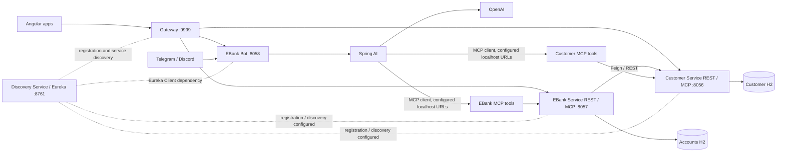

# Design — Project Foundation & Architecture Baseline

## 1. Contexte et périmètre

Cette évolution établit la première baseline formelle de System Design. Elle est
documentaire : elle ne change ni l'implémentation, ni le comportement runtime,
ni les dépendances applicatives.

Le workspace local contient `PROJECT-CONTEXT.md` et `requirements.md`, mais
aucun code applicatif. Les détails d'implémentation ci-dessous ont donc été
observés dans le dépôt Youssfi de référence à la révision
`bf4c7f2750e4c731662e8138023fd8e6b4e4a475` et ne doivent pas être présentés
comme vérifiés localement. La référence reste pédagogique et n'est pas intégrée.

Les mentions **Vérifié (référence)**, **Déduit** et **À confirmer** séparent les
niveaux de preuve.

## 2. Vue logique actuelle



Le diagramme représente les composants et relations observés. La position
géographique de l'appel Gateway vers les services dépend du routage découvert
effectif, à confirmer à l'exécution. Les appels du bot aux serveurs MCP utilisent
des URL locales explicites dans la configuration consultée.

## 3. Composants et frontières

| Composant | Faits vérifiés dans la référence | Déduction et limites |
|---|---|---|
| `discovery-service` | Serveur Eureka annoté `@EnableEurekaServer`, port 8761; ne s'enregistre pas lui-même et ne récupère pas de registre selon ses propriétés. | Point de dépendance du routage dynamique. La haute disponibilité du registre n'est pas démontrée. |
| `gateway-service` | Gateway WebFlux, Eureka Client, port 9999; bean `DiscoveryClientRouteDefinitionLocator`; CORS global wildcard. Les routes statiques du YAML sont commentées. | Frontière HTTP pour les appels web observés. Un arrêt affecterait ces parcours; le routage automatique exact nécessite validation runtime. |
| `customer-service` | Spring Web, JPA, H2, Eureka Client, Actuator, OpenAPI, MCP Server WebMVC; Customer id/name/email; REST customers. | Propriétaire logique des données Customer. H2 mémoire rend les données de démonstration éphémères. |
| `ebank-service` | Spring Web, JPA, H2, Eureka Client, Feign, Resilience4j, MCP Server WebMVC; BankAccount et routes accounts. | Propriétaire des comptes; `customerId` représente une référence inter-service plutôt qu'une association JPA. Les appels Customer créent un couplage synchrone. |
| `ebank-bot` | Spring Web, Spring AI OpenAI, client MCP, Eureka Client, Actuator, Telegram et Discord; API chat sur port 8058. | Adaptateur conversationnel/orchestrateur AI. Dépend du LLM, des plateformes et des outils MCP. La mémoire est configurée via advisor mais sa persistance n'est pas établie. |
| `angular-front` | Angular 21.1; vues comptes et bot; appels via Gateway; utilise `/chatStream` dans le code observé. | Client web métier et conversationnel. Le code analysé utilise une URL de base locale codée en dur. |
| `ebank-ang-front` | Angular 21.1; vues comptes et bot; appels via Gateway. Le parcours nommé streaming appelle `/chat`, pas `/chatStream`. | Fonctionnellement proche du premier frontend. Le but de la duplication et l'écart de streaming restent à confirmer. |

### Dépendances Maven notables (référence)

- Boot parent 3.5.10 et Java 21 dans les POMs consultés.
- Spring Cloud BOM 2025.0.1 dans les services concernés.
- Spring AI BOM 1.1.2 pour les modules MCP et bot.
- Customer : Web, Data JPA, H2, Eureka Client, Config Client, Actuator,
  OpenAPI, MCP Server WebMVC, tests et Lombok.
- EBank : mêmes fondations métier, plus OpenFeign et
  `spring-cloud-starter-circuitbreaker-resilience4j`.
- Gateway : Gateway Server WebFlux, Eureka Client, Actuator, tests WebFlux.
- Bot : Web, Spring AI OpenAI, MCP Client, Eureka Client, Actuator, OpenAPI,
  starter Discord et Telegram.
- Discovery : Eureka Server, Actuator et tests.
- Le starter Config est présent dans Customer, EBank et Bot, mais le client
  Config est désactivé (`spring.cloud.config.enabled=false`) dans les propriétés
  consultées; aucun Config Server n'a été identifié.
- Les Angulars déclarent Angular 21.1, RxJS, Bootstrap/ngx-markdown et scripts
  `start`, `build`, `test`.

Cette liste reflète les POMs/package manifests consultés et ne prétend pas
décrire l'arbre transitif résolu ou le comportement d'exécution.

## 4. Interfaces et flux

### 4.1 API REST observée

| Service | Méthode et chemin | Utilisation observée |
|---|---|---|
| Customer | `GET /customers` | Liste les clients. |
| Customer | `GET /customers/{id}` | Retourne un client par identifiant; utilisé par Feign. |
| Customer | `POST /customers` | Crée un client. |
| EBank | `GET /accounts` | Liste les comptes sans enrichissement Customer dans le chemin consulté. |
| EBank | `GET /accounts/{id}` | Retourne un compte et appelle Customer pour renseigner le client. |
| EBank | `POST /accounts` | Appelle Customer puis persiste le compte. |
| Bot | `GET /chat?query=...` | Appel synchrone au ChatClient. |
| Bot | `GET /chatStream?query=...` | Produit un `Flux<String>` pour la réponse streamée HTTP. |

Les routes REST sont observées dans les contrôleurs consultés. Le comportement
HTTP en erreur, les validations, la pagination et les contrats d'API complets
ne sont pas décrits ici.

### 4.2 Frontend → Gateway → services

```text
angular-front / ebank-ang-front
        | GET /EBANK-SERVICE/accounts
        | GET /EBANK-BOT/chat (et selon le frontend /chatStream)
        v
Gateway WebFlux :9999
        |
        +-- destination de service via discovery locator (intention/config observée)
                |
                +--> EBank Service :8057 --> H2
                +--> EBank Bot :8058 --> Spring AI
```

**Vérifié (référence)** : clients HTTP directs vers le port 9999 avec les
identifiants `EBANK-SERVICE` et `EBANK-BOT`; le bean de discovery locator est
déclaré. Le YAML présente CORS autorisant toutes les origines, méthodes et
en-têtes. Les routes statiques sont commentées.

**Déduit** : le Gateway centralise les destinations vues par le navigateur et
permet le routage basé sur le registre plutôt que sur des routes fixes.

**À confirmer** : routes effectivement produites, normalisation des chemins,
équilibrage, comportement en perte d'Eureka, et inclusion éventuelle d'autres
chemins que les requêtes frontend.

### 4.3 EBank → Customer via Feign/REST

```text
Client
  -> EBank REST / MCP
  -> EbankService
  -> CustomerRestClient (@FeignClient(name = "customer-service"))
  -> HTTP GET /customers/{id}
  -> Customer Service
  -> H2 Customer
```

L'échange est synchrone : l'appelant attend la réponse. Feign fournit l'abstraction
déclarative du client, mais l'interface distante reste REST/HTTP. EBank enregistre
le compte dans sa propre base.

**Fait vérifié (référence)** : `getBankAccountById` enrichit le compte avec la
réponse Customer; `save` consulte Customer avant la sauvegarde; `getAllBankAccounts`
retourne le résultat du dépôt sans appel Customer.

**Risque déduit** : l'annotation circuit breaker du Feign client peut appeler un
fallback synthétique (« Not available »); la sauvegarde ne valide pas ensuite que
le Customer retourné est réel. Une panne peut ainsi permettre l'enregistrement
d'un compte sans validation effective du client.

**À confirmer** : politiques de timeout/retry/circuit breaker réellement actives,
codes d'erreur et règles métier attendues lors d'une panne Customer.

### 4.4 Bot → Spring AI → MCP → services

```text
Utilisateur web --> Gateway --> Bot /chat ou /chatStream
Telegram (long polling) -------> Bot
Discord (message event) -------> Bot
                                  |
                                  v
                          Spring AI ChatClient
                          /               \
                    OpenAI LLM       ToolCallbackProvider
                                           |
                                      MCP Client
                                     /           \
                   http://localhost:8056/mcp   http://localhost:8057/mcp
                           |                            |
                     Customer MCP                 EBank MCP
                           |                            |
                  Customer methods            EbankService methods
                                                        |
                                                        +-- Feign --> Customer
```

**Faits vérifiés (référence)** :

- Bot configure le modèle `gpt-4o`, un `ToolCallbackProvider` et un
  `MessageChatMemoryAdvisor`.
- Customer et EBank ont des méthodes métier annotées `@McpTool` et une
  configuration MCP server WebMVC avec protocole `streamable`.
- Le Bot configure des destinations MCP via localhost (`8056/mcp`, `8057/mcp`).
- Telegram reçoit les messages en long polling; Discord transmet les messages
  reçus à l'agent. La réponse est obtenue via `aiAgent.chat(...)`.

**Déductions** : les outils MCP réutilisent des méthodes métier et peuvent
entraîner les mêmes effets métier que les interfaces de service; le parcours
dépend du modèle externe et du service qui héberge l'outil. Les accès aux
plateformes et au LLM sont des dépendances supplémentaires du bot.

**À confirmer** : contrôle d'accès aux outils, disponibilité et filtrage des
outils, portée/stockage de la mémoire, traitement des erreurs, timeouts et
comportement du bot en cas d'indisponibilité LLM/MCP.

## 5. Modes de communication et propriété des données

| Mode | Usage observé | Sémantique / limite |
|---|---|---|
| REST/HTTP | APIs Customer, EBank, bot; transport sous-jacent de Feign. | Request/response synchrone dans les parcours observés. |
| OpenFeign | EBank vers Customer via le nom de service `customer-service`. | Client déclaratif REST, pas protocole différent. |
| MCP | Bot client vers serveurs de capacités Customer et EBank. | Contrat de capacité destiné au client AI; distinct des routes REST frontend. Transport serveur configuré `streamable`. |
| HTTP streaming | `/chatStream` du bot consommé par `angular-front`. | Réponse HTTP streamée; ne constitue pas un flux événementiel métier. |
| Événementiel métier | Aucun broker ou flux événementiel observé. | Kafka reste hors périmètre de cette évolution selon REQ-003/004/REQ-011. |

La propriété des données est **déduite** du découpage et des persistences :
Customer détient Customer dans son H2; EBank détient BankAccount dans son H2 et
une référence `customerId`. Aucune relation transactionnelle inter-base ni
transaction distribuée n'est observée. Les deux bases H2 sont configurées en
mémoire et alimentées par des données d'initialisation; aucune durabilité au-delà
du cycle du processus ne doit être supposée.

## 6. System Design

### Frontières et couplages

- **Vérifié** : Customer et EBank ont des services, contrôleurs, repositories et
  entités séparés; chacun possède sa datasource configurée.
- **Déduit** : la propriété séparée des données réduit le couplage de stockage,
  mais EBank reste fonctionnellement dépendant de Customer lors de deux parcours.
- **Vérifié** : les frontends utilisent Gateway; le bot appelle les serveurs MCP
  par des destinations directes configurées.
- **Déduit** : la combinaison d'appels Gateway/discovery, d'appels Feign et
  d'appels LLM/MCP rend les chemins de panne différents selon le canal utilisé.

### Disponibilité et résilience

- **Vérifié** : un seul service Eureka est configuré dans les sources étudiées;
  EBank déclare un circuit breaker et un fallback Customer.
- **Déduit** : Eureka, Gateway, Customer, EBank, bot, plateformes de messagerie,
  LLM et MCP peuvent constituer des dépendances critiques pour leurs chemins
  respectifs. Un arrêt du Gateway affecte les clients qui l'utilisent; un arrêt
  Customer affecte les opérations EBank qui l'appellent.
- **Vérifié** : le fallback EBank crée un Customer synthétique; le service
  d'enregistrement du compte ne rejette pas ce résultat de fallback avant
  persistance.
- **À confirmer** : réplication, cache de registre, timeouts, retries, seuils,
  gestion d'indisponibilité, idempotence et traitement métier des erreurs.

### Performance et capacité

- **Vérifié** : les parcours web passent par Gateway; certains parcours EBank
  appellent ensuite Customer; le bot appelle un fournisseur LLM et éventuellement
  un outil MCP.
- **Déduit** : ces sauts réseau et appels externes augmentent la latence de bout
  en bout; le LLM et les outils MCP peuvent dominer le temps de réponse AI.
- **Vérifié** : les datasources H2 utilisent `mem:` et les destinations MCP du bot
  sont localhost.
- **Déduit** : ces paramètres privilégient un démarrage local simple et limitent
  la démonstration d'une mise à l'échelle multi-instance avec état durable.
- **À confirmer** : débit, limites de concurrence, mesures de latence, objectifs
  de disponibilité et comportement de charge; aucun benchmark/SLO n'est fourni.

### Sécurité

- **Vérifié** : les POMs consultés n'incluent pas Spring Security; le Gateway
  autorise globalement toutes les origines, méthodes et en-têtes via CORS; les
  méthodes MCP comprennent des opérations de création.
- **Déduit** : l'exposition des endpoints et outils sans mécanisme visible
  d'authentification est un risque d'accès, mais les contrôles externes ou
  d'environnement ne sont pas inspectés.
- **À confirmer** : exposition réseau réelle, protection des outils/endpoints MCP,
  secrets LLM/Telegram/Discord et exposition des consoles/endpoints de gestion.
- Cette évolution documente ces limites seulement; elle ne conçoit ni n'implémente
  un mécanisme de sécurité.

### Observabilité

- **Vérifié** : Actuator est une dépendance listée pour Gateway, Discovery,
  Customer, EBank et Bot.
- **À confirmer** : endpoints exposés, health checks configurés, format/corrélation
  des logs et métriques réellement collectées.
- Aucune instrumentation distribuée avancée ne doit être supposée ou introduite
  dans ce change.

### Alternatives et compromis

| Décision observée | Besoin adressé | Alternative pertinente | Compromis |
|---|---|---|---|
| Gateway + routage découvert | Entrée web et destinations de services centralisées. | URLs directes côté clients ou routes fixes. | Centralisation et découverte contre un composant supplémentaire et une dépendance de routage/registre. |
| Eureka | Découverte par identifiant plutôt que connaissance des adresses d'instances. | Configuration statique des adresses. | Découverte dynamique contre opération et disponibilité du registre; le mode haute disponibilité n'est pas démontré. |
| Feign sur REST | Client inter-service déclaratif, intégré à Spring Cloud. | Client HTTP explicite ou appels directs depuis le client. | Lisibilité et intégration discovery contre couplage d'exécution synchrone et latence réseau. |
| MCP pour outils AI | Décrire des capacités appelables par le client AI. | Appels REST directs du bot aux APIs métier. | Interface de capacités adaptée à l'usage AI contre protocole/contrat supplémentaire et exigences de contrôle d'accès à vérifier. |
| H2 mémoire | Exécution locale/pédagogique légère. | Stockage persistant déployé. | Simplicité d'exécution contre perte d'état à l'arrêt et limites de démonstration distribuée. |

Kafka n'est pas une alternative à implémenter dans ce change; seule sa place
future est mentionnée dans `requirements.md`.

## 7. Limites et questions ouvertes

1. Les sources locales de services ne sont pas présentes; la correspondance
   entre la référence et le futur code du projet est à confirmer.
2. Les routes et filtres effectivement créés par discovery locator n'ont pas été
   validés par démarrage du système.
3. La configuration runtime des circuits, timeouts et retries n'est pas établie.
4. Le fallback peut permettre une création de compte sans validation Customer;
   la politique métier attendue doit être clarifiée, sans être modifiée ici.
5. Les contrôles d'accès MCP et les secrets d'intégration ne sont pas déterminés.
6. Le stockage et la portée de `ChatMemory` ne sont pas établis par les sources
   examinées.
7. `angular-front` et `ebank-ang-front` sont proches; les différences
   fonctionnelles attendues restent à établir, notamment leur comportement de
   streaming.
8. L'usage du starter Config alors que le client est désactivé, et l'absence de
   Config Server identifié, sont à expliquer si cela reste pertinent au projet.
9. L'état opérationnel Actuator, les objectifs de performance et les garanties
   de disponibilité ne sont pas documentés.

## 8. Conséquences pour cette évolution

- La baseline doit être utile sans runtime local ni hypothèses non prouvées.
- Les faits de la référence doivent être associés à la révision consultée.
- Les questions ouvertes restent explicitement ouvertes jusqu'à disponibilité
  des sources du projet ou vérification runtime ultérieure.
- La documentation de contexte/interview peut être mise à jour dans la phase
  d'exécution documentaire, conformément aux requirements.
- Aucun service, endpoint, dépendance, sécurité ou déploiement ne change.
