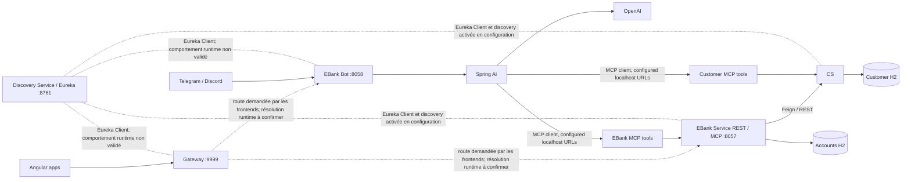

# Design — Project Foundation & Architecture Baseline

## 1. Contexte et périmètre

Cette évolution établit la première baseline formelle de System Design. Elle est
documentaire : elle ne change ni l'implémentation, ni le comportement runtime,
ni les dépendances applicatives.

**Faits vérifiés dans le workspace local** — l'inventaire récursif des fichiers
(hors métadonnées Git) a trouvé :

- À la racine : `.gitignore`, `PROJECT-CONTEXT.md`, `requirements.md`.
- Règles : `.github/skills/project-architecture/SKILL.md` et
  `.github/skills/agents/system-design-architect.agent.md`.
- Configuration IDE : `.idea/.gitignore`, `.idea/misc.xml`,
  `.idea/modules.xml`, `.idea/total-micro-services-spring-ai-mcp-angular.iml`,
  `.idea/vcs.xml`, `.idea/workspace.xml`.
- Change OpenSpec courant :
  `openspec/changes/project-foundation-architecture-baseline/proposal.md`,
  `design.md`, `tasks.md` et
  `specs/architecture-baseline/spec.md`.

`PROJECT-CONTEXT.md` et `requirements.md` sont bien présents. L'inventaire n'a
trouvé aucun code applicatif (`.java`, `.ts`, etc.), aucun POM Maven, ni projet
Angular (`package.json`, `angular.json` ou arborescence `src` d'application).
Il n'a pas trouvé non plus de `specification.md` à la racine; la spécification
de ce change est `specs/architecture-baseline/spec.md`.

Les détails d'implémentation ci-dessous proviennent du dépôt Youssfi
https://github.com/mohamedYoussfi/totale-micro-services-spring-ai-mcp-angular-telegram-discord,
branche `main`, révision
`bf4c7f2750e4c731662e8138023fd8e6b4e4a475`, déjà référencée dans les artefacts
d'exploration. Ils sont des constats de cette référence pédagogique, jamais des
constats du code local. Le dépôt n'a pas été copié, cloné ou intégré au projet.

Les mentions **Vérifié (référence)**, **Déduit** et **À confirmer** séparent les
niveaux de preuve.

## 2. Architecture observée dans la référence pédagogique



**Déduction architecturale** : le diagramme résume les relations logiques
documentées dans la référence, mais ne constitue pas une validation des flux à
l'exécution. Les flèches pointillées du Gateway indiquent des destinations
demandées par les frontends et un mécanisme de découverte déclaré; la résolution,
la réécriture et le succès du routage restent **à confirmer**. Les liens Eureka
montrent les dépendances/configurations observées, pas une inscription ou
découverte testée. Les appels du bot aux serveurs MCP utilisent des URL locales
explicites dans la configuration de référence. Aucun composant de ce diagramme
n'est de ce fait automatiquement retenu dans l'architecture cible de notre
projet.

## 3. Composants observés, analyse et pertinence éventuelle

Cette cartographie porte sur les sept composants nommés dans les requirements
et observés dans le dépôt pédagogique. Les faits techniques ci-dessous sont
vérifiés dans les POMs, manifestes, sources et configurations consultés à la
révision indiquée en section 1. Les analyses sont des déductions et non des
résultats de tests runtime. Pour chaque composant, la pertinence pour notre
projet reste à évaluer; aucune décision de conservation n'est prise ici.

### 3.1 `discovery-service`

- **Observé dans Youssfi — responsabilité et technologies (fait vérifié)** :
  application Spring Boot, Java 21, Spring Cloud 2025.0.1, Eureka Server,
  Actuator. Elle active Eureka Server et écoute sur le port 8761; sa
  configuration désactive son propre enregistrement et la récupération du
  registre.
- **Dépendances et communications (fait vérifié)** : dépend d'Eureka Server et
  Actuator; les autres services qui déclarent Eureka Client/configuration de
  discovery peuvent s'enregistrer ou consulter le registre. La réussite de ces
  interactions n'a pas été testée.
- **Données** : **fait vérifié** — aucun stockage métier propre n'est identifié
  dans le code consulté. **Déduction à partir du rôle Eureka** — le registre
  traite des métadonnées d'instances; la persistance ou la configuration de
  cluster n'est pas établie par les sources consultées.
- **Rôle dans les flux** : fournit la découverte utilisée par le locator du
  Gateway et le nom de service du client Feign. Les URL MCP du bot, elles, sont
  configurées en localhost et n'utilisent pas cette résolution.
- **Analyse / apprentissage** : illustre la différence entre adresse fixe et
  résolution par nom de service. Un registre dédié ajoute une dépendance et un
  point opérationnel; aucune haute disponibilité n'est démontrée.
- **Pertinence / décision future** : la découverte dynamique peut être utile si
  notre topologie a des services/instances à localiser. **À décider** si nous
  avons besoin d'un registre dédié, d'une autre forme de découverte ou d'aucun
  composant de découverte.

### 3.2 `gateway-service`

- **Observé dans Youssfi — responsabilité et technologies (fait vérifié)** :
  point d'entrée HTTP visé par les frontends; Java 21, Spring Boot 3.5.10,
  Spring Cloud Gateway WebFlux, Eureka Client et Actuator; port 9999. La classe
  déclare un `DiscoveryClientRouteDefinitionLocator`. La configuration YAML
  présente un CORS wildcard. Les routes statiques proposées sont commentées.
- **Dépendances et communications (fait vérifié)** : reçoit les requêtes web
  adressées par les frontends; dépend du mécanisme de découverte déclaré pour
  générer des routes. Les chemins frontend et l'effet des routes découverts
  sont décrits séparément en section 4.2; aucun succès de routage runtime n'est
  affirmé ici.
- **Données** : aucune donnée métier ou persistance propre au Gateway n'est
  identifiée dans le code consulté.
- **Rôle dans les flux** : médiateur HTTP entre clients web et services
  enregistrés, selon l'intention du code et les URLs côté frontends.
- **Analyse / apprentissage** : permet d'étudier la centralisation d'entrée et
  le routage, au prix d'un saut réseau et d'une dépendance additionnelle. CORS
  contrôle les requêtes cross-origin des navigateurs, mais ne constitue pas une
  authentification. La configuration effective des routes et sa tolérance aux
  pannes restent à confirmer.
- **Pertinence / décision future** : peut être pertinent si le projet a besoin
  d'une frontière HTTP commune ou de fonctions transverses effectivement
  requises. **À décider** si un Gateway est nécessaire, quelles responsabilités
  lui confier et s'il doit s'appuyer sur une découverte dynamique.

### 3.3 `customer-service`

- **Observé dans Youssfi — responsabilité et technologies (fait vérifié)** :
  API de gestion des clients et serveur MCP. Java 21, Spring Boot 3.5.10,
  Spring Web MVC, Spring Data JPA/Hibernate, H2, Eureka Client, Actuator,
  OpenAPI, MCP Server WebMVC; Spring Cloud 2025.0.1 et Spring AI 1.1.2.
- **Dépendances et communications (fait vérifié)** : reçoit REST sur
  `/customers` et capacités MCP; dépend de sa base H2 et déclare Eureka Client.
  Le POM contient le starter Spring Cloud Config, mais la propriété consultée
  désactive le client Config; aucun Config Server n'a été identifié.
- **Données (fait vérifié)** : entité Customer avec `id`, `name`, `email`, gérée
  via JPA; URL datasource `jdbc:h2:mem:customer-db`. Des clients de démonstration
  sont créés au démarrage. L'état de cette base en mémoire n'est pas une
  persistance durable entre redémarrages.
- **Rôle dans les flux** : expose les données clients via REST, répond aux
  appels EBank via Feign/REST et met ses méthodes annotées `@McpTool` à
  disposition du client MCP pour lecture et création de clients.
- **Analyse / apprentissage** : illustre une frontière de responsabilité et de
  données clients, partageable via interfaces sans accès direct à la base par
  EBank. Une frontière service/base distincte ajoute un coût d'exploitation et
  ne supprime pas les défaillances réseau.
- **Pertinence / décision future** : une capacité client est justifiée si elle
  correspond à un domaine et à un besoin indépendants. **À décider** si elle
  reste un service autonome, fusionne avec un autre périmètre ou est représentée
  autrement dans notre application.

### 3.4 `ebank-service`

- **Observé dans Youssfi — responsabilité et technologies (fait vérifié)** :
  API de comptes bancaires et serveur MCP. Java 21, Spring Boot 3.5.10,
  Spring Web MVC, Spring Data JPA/Hibernate, H2, Eureka Client, OpenFeign,
  Resilience4j, Actuator, OpenAPI et MCP Server WebMVC; Spring Cloud 2025.0.1
  et Spring AI 1.1.2.
- **Dépendances et communications (fait vérifié)** : reçoit REST et MCP; appelle
  Customer par un client Feign déclaré avec le nom `customer-service` et HTTP
  REST; dépend de sa base H2. Le POM comprend Config Client, mais la propriété
  consultée le désactive; aucun Config Server n'a été identifié.
- **Données (fait vérifié)** : BankAccount persisté par JPA avec `id`,
  `createdAt`, `balance`, `type` et `customerId`. Le champ `customer` est
  `@Transient` et n'est pas une relation JPA persistée. URL H2 :
  `jdbc:h2:mem:accounts-db`; des comptes de démonstration sont créés au
  démarrage.
- **Rôle dans les flux** : possède les comptes; dans certains parcours appelle
  Customer et expose des opérations de compte par REST et par annotations MCP.
  Les précisions de routes, circuit breaker et comportements associés sont
  traitées dans les sections 4.1 et 4.3 (pas redéfinies ici).
- **Analyse / apprentissage** : illustre une séparation de domaine et l'appel
  synchrone entre services. Ce choix crée un couplage de disponibilité; le
  fallback Customer observé soulève un risque de validation métier détaillé en
  section 4.3. H2 mémoire limite la démonstration de durabilité.
- **Pertinence / décision future** : un périmètre bancaire dédié peut être utile
  pour le domaine métier et les exercices de communication distribuée.
  **À décider** si cette frontière, son stockage et ses interfaces sont adaptés
  à nos exigences, ou si un regroupement/remplacement est plus simple.

### 3.5 `ebank-bot`

- **Observé dans Youssfi — responsabilité et technologies (fait vérifié)** :
  adaptateur conversationnel avec API Web et intégration Telegram/Discord.
  Java 21, Spring Boot 3.5.10, Spring Web, Spring AI OpenAI, MCP Client,
  Eureka Client, Actuator, OpenAPI, starter Discord et Telegram; port 8058.
  Le modèle configuré est `gpt-4o`; le ChatClient reçoit un
  `ToolCallbackProvider` et un `MessageChatMemoryAdvisor`.
- **Dépendances et communications (fait vérifié)** : reçoit des messages
  Telegram (long polling), des événements Discord et des requêtes Web; appelle
  OpenAI et des serveurs MCP via les URL locales configurées
  `http://localhost:8056/mcp` et `http://localhost:8057/mcp`. Le bot déclare
  Eureka Client, mais ces destinations MCP ne s'appuient pas sur Eureka.
- **Données** : aucune entité ou base métier propre au bot n'est identifiée
  dans les sources consultées. La présence de `ChatMemory` advisor est
  vérifiée; le stockage et la portée de cette mémoire sont **à confirmer**.
- **Rôle dans les flux** : adapte les canaux conversationnels et l'API web au
  ChatClient, qui peut utiliser les capacités MCP disponibles. Cela ne prouve
  pas que chaque requête appelle systématiquement un outil.
- **Analyse / apprentissage** : permet d'étudier la séparation canal/
  orchestration AI/capacités métier et l'intégration d'un LLM. Il ajoute des
  dépendances externes et des chemins d'échec (fournisseur LLM, plateformes,
  MCP); les erreurs, timeouts et contrôles d'accès ne sont pas établis ici.
- **Pertinence / décision future** : une interface conversationnelle vaut la
  peine si elle répond à un cas d'usage métier ou pédagogique défini.
  **À décider** si le bot existe comme composant séparé, quels canaux il sert,
  et si Spring AI/MCP sont utiles aux exigences retenues.

### 3.6 `angular-front`

- **Observé dans Youssfi — responsabilité et technologies (fait vérifié)** :
  application Angular 21.1 consommant la liste de comptes et l'API du bot;
  manifestes déclarant Angular, TypeScript, RxJS, Bootstrap et ngx-markdown.
  Le code consulte les comptes et appelle `/chatStream` pour le parcours de
  réponse streamée.
- **Dépendances et communications (fait vérifié)** : utilise `HttpClient` et
  appelle le Gateway à `localhost:9999` avec les identifiants de service
  présents dans les chemins. Les URLs de base sont codées dans le code client
  consulté; le succès du routage n'est pas vérifié.
- **Données** : modèles/état côté client pour afficher les comptes et les
  réponses; aucune persistance métier frontend n'est identifiée.
- **Rôle dans les flux** : interface navigateur du parcours comptes et du chat,
  en passant par le Gateway.
- **Analyse / apprentissage** : montre l'intégration HTTP d'une UI dans une
  architecture distribuée; le codage d'URLs locales lie le client au profil
  d'exécution observé.
- **Pertinence / décision future** : à évaluer selon le besoin d'interface
  navigateur et les objectifs d'apprentissage. **À décider** si ce frontend est
  conservé, adapté, fusionné avec une autre UI ou remplacé.

### 3.7 `ebank-ang-front`

- **Observé dans Youssfi — responsabilité et technologies (fait vérifié)** :
  seconde application Angular 21.1, avec des vues de comptes et de bot proches
  de `angular-front`; manifestes déclarant Angular, TypeScript, RxJS, Bootstrap
  et ngx-markdown.
- **Dépendances et communications (fait vérifié)** : utilise `HttpClient` pour
  appeler le Gateway à `localhost:9999`. Le parcours nommé streaming appelle
  `/chat`, et non le endpoint `/chatStream` décrit dans le bot.
- **Données** : modèle/état de compte et réponse conversationnelle utilisés pour
  l'affichage; aucune persistance métier frontend n'est identifiée.
- **Rôle dans les flux** : deuxième client navigateur des APIs EBank et du bot.
  Les sources consultées ne définissent pas son rôle distinct de la première UI.
- **Analyse / apprentissage** : permet de comparer des clients semblables et met
  en évidence une divergence de chemin pour le streaming; la raison de la
  duplication et le comportement exact à l'exécution restent à confirmer.
- **Pertinence / décision future** : **à décider** si le projet a besoin d'une
  ou de plusieurs interfaces web; cette application peut être conservée,
  fusionnée, remplacée ou écartée selon la valeur fonctionnelle et pédagogique.

### Conventions et limites transverses

- **Faits vérifiés dans les manifests de référence** : les POMs consultés
  utilisent Java 21 et Spring Boot 3.5.10; les modules concernés importent
  Spring Cloud BOM 2025.0.1 et les composants Spring AI BOM 1.1.2. Les deux
  frontends déclarent Angular 21.1 et scripts `start`, `build`, `test`.
- Les listes de dépendances décrivent les dépendances directes consultées; elles
  ne prétendent pas reproduire l'arbre transitif résolu ni le comportement
  runtime.
- **À confirmer** : les sources du projet local n'étant pas présentes, aucune
  correspondance entre ces composants de référence et les composants de notre
  application n'est établie.
- **Décision future à prendre** : évaluer chaque responsabilité et frontière à
  partir du besoin métier, des exigences fonctionnelles/non fonctionnelles, des
  communications requises, des risques et coûts opérationnels, de la simplicité,
  de la maintenabilité, de l'évolutivité et de la valeur pédagogique. Aucun des
  sept composants n'est automatiquement conservé; des services peuvent être
  fusionnés, remplacés ou supprimés, et d'autres composants ne doivent être
  créés que si une séparation est justifiée.

## 4. Interfaces et flux

### 4.1 API REST — routes observées dans les contrôleurs de référence

Le tableau distingue les routes déclarées dans les contrôleurs de la manière
dont les frontends les appellent. Les signatures et types ci-dessous sont des
**faits vérifiés dans le code de référence**; l'exécution et les réponses HTTP
réelles n'ont pas été testées.

| Service | Méthode / route | Rôle et entrée vérifiés | Réponse déclarée dans le code | Appelant observé |
|---|---|---|---|---|
| Customer | `GET /customers` | Lister les clients; aucune entrée déclarée. | `List<Customer>` (JSON attendu par Spring MVC). | Aucun appel direct depuis les frontends n'a été identifié. |
| Customer | `GET /customers/{id}` | Rechercher un client par `id` de type `Long`. | `Customer` (JSON attendu par Spring MVC). | Aucun appel direct depuis les frontends n'a été identifié; l'appel interne EBank/Feign est hors du flux frontend et sera détaillé en 2.4. |
| Customer | `POST /customers` | Créer un client à partir d'un corps `Customer` (`@RequestBody`). | `Customer` renvoyé par le service. | Aucun appel direct depuis les frontends n'a été identifié. |
| EBank | `GET /accounts` | Lister les comptes; aucune entrée déclarée. | `List<BankAccount>` (JSON attendu par Spring MVC). | Les deux frontends demandent cette liste via Gateway. |
| EBank | `GET /accounts/{id}` | Lire un compte par `id` de type `String`. | `BankAccount` (JSON attendu par Spring MVC). | Aucun appel direct depuis les frontends n'a été identifié. |
| EBank | `POST /accounts` | Créer un compte à partir d'un corps `BankAccount` (`@RequestBody`). | `BankAccount` renvoyé par le service. | Aucun appel direct depuis les frontends n'a été identifié. |
| EBank Bot | `GET /chat?query=...` | Soumettre une requête texte; `query` est un paramètre avec défaut `"Bonjour"`. | `String`, déclaré `text/plain`. | Les deux frontends appellent cette route via Gateway. |
| EBank Bot | `GET /chatStream?query=...` | Soumettre une requête texte; `query` est un paramètre avec défaut `"Bonjour"`. | `Flux<String>`, déclaré `text/plain`. | `angular-front` appelle cette route via Gateway; aucun appel à cette route n'a été identifié dans `ebank-ang-front`. |

Les types indiquent le contrat visible dans les signatures de contrôleur, pas
un schéma JSON complet ni un résultat vérifié sur le réseau. Codes HTTP,
erreurs, validations, pagination et contraintes des corps ne sont pas établis
par cette seule liste.

### 4.2 Appels frontend → Gateway → services

**Appels observés (faits vérifiés dans les sources Angular)** :

| Frontend | Opération HTTP côté client | URL/chemin utilisé côté frontend | Route de contrôleur correspondante | Destination logique indiquée par le préfixe |
|---|---|---|---|---|
| `angular-front` | `GET` comptes | `http://localhost:9999/EBANK-SERVICE/accounts` | EBank `GET /accounts` | `EBANK-SERVICE` (EBank) |
| `ebank-ang-front` | `GET` comptes | `http://localhost:9999/EBANK-SERVICE/accounts` | EBank `GET /accounts` | `EBANK-SERVICE` (EBank) |
| `angular-front` | `GET` chat | `http://localhost:9999/EBANK-BOT/chat?query=...` | Bot `GET /chat?query=...` | `EBANK-BOT` |
| `angular-front` | `GET` chat avec chemin `chatStream` | `http://localhost:9999/EBANK-BOT/chatStream?query=...` | Bot `GET /chatStream?query=...` | `EBANK-BOT` |
| `ebank-ang-front` | `GET` chat | `http://localhost:9999/EBANK-BOT/chat?query=...` | Bot `GET /chat?query=...` | `EBANK-BOT` |
| `ebank-ang-front` | `GET` méthode cliente nommée `askAgentSteam` | `http://localhost:9999/EBANK-BOT/chat?query=...` | Bot `GET /chat?query=...` | `EBANK-BOT` |

Les valeurs effectives de `query` sont concaténées par le code Angular à partir
du texte saisi. Les appels observés ciblent directement le port Gateway
`localhost:9999`; les chemins comportent les identifiants `EBANK-SERVICE` et
`EBANK-BOT`. Il n'y a pas d'appel frontend direct observé aux routes Customer,
à `GET /accounts/{id}` ou à `POST /accounts`.

**Gateway — faits vérifiés dans le code/configuration de référence** :

- Le Gateway écoute sur le port `9999`; les frontends utilisent l'adresse
  `http://localhost:9999`.
- La classe de démarrage déclare un `DiscoveryClientRouteDefinitionLocator`.
  Le mécanisme est déclaré pour créer des définitions de routes à partir des
  services découverts; cela n'établit pas que les routes ont été produites ou
  qu'une requête a été routée avec succès.
- Les préfixes `EBANK-SERVICE` et `EBANK-BOT` désignent respectivement les
  destinations logiques demandées par les URLs Angular. Les chemins finaux
  transmis aux contrôleurs et les transformations éventuelles ne sont pas
  validés par un test runtime.
- Le YAML du Gateway contient des routes statiques `/customers/**` et
  `/accounts/**` sous forme commentée; elles ne sont donc pas des routes
  statiques actives dans cette configuration.

**Rôle (déduction)** : le Gateway sert de point d'entrée HTTP commun aux
frontends observés et de médiateur vers les destinations logiques de service.
Cette description reflète l'intention exprimée par les URLs et la configuration,
pas une preuve de fonctionnement en exécution.

**À confirmer** : génération/résolution effective des routes, conservation ou
suppression du préfixe de service, correspondance exacte des chemins, réponse
des services et succès des appels. Ces points requièrent une validation runtime;
ils ne sont pas supposés dans cette baseline.

#### Eureka et découverte du Gateway — tâche 2.3

**Faits vérifiés dans la référence** :

- `discovery-service` active Eureka Server sur le port `8761`; ses propriétés
  désactivent `register-with-eureka` et `fetch-registry`.
- Gateway, Customer, EBank et Bot déclarent un client Eureka ou une configuration
  de discovery active dans les manifests/propriétés consultés. Gateway, Customer
  et EBank ont `spring.cloud.discovery.enabled=true`; Bot déclare également
  cette propriété. Cette présence/configuration établit une intention de client,
  pas que chaque instance s'est effectivement enregistrée.
- La classe de démarrage du Gateway construit un
  `DiscoveryClientRouteDefinitionLocator` à partir d'un
  `ReactiveDiscoveryClient` et de `DiscoveryLocatorProperties`.
- Les chemins frontend utilisent les préfixes logiques `EBANK-SERVICE` et
  `EBANK-BOT`. Le Bot, bien qu'il déclare Eureka Client, configure ses
  connexions MCP avec des URL `localhost` fixes; ces destinations ne sont pas
  obtenues via Eureka.
- Le YAML du Gateway contient des routes statiques vers `localhost:8056` et
  `localhost:8057` pour `/customers/**` et `/accounts/**`, mais les lignes sont
  commentées et ne configurent donc pas ces routes statiques activement.

**Déduction** : le locator permet au Gateway de construire des définitions de
route à partir des instances connues du client Discovery, plutôt que de reposer
uniquement sur les deux destinations statiques proposées dans le YAML. Eureka
joue le rôle du registre auquel les clients peuvent publier ou demander les
informations d'instances; son usage par le locator est la relation configurée
qui explique la destination logique des préfixes frontend.

**Non vérifié en runtime** : enregistrement et renouvellement des clients dans
Eureka, contenu du registre, génération des routes, forme exacte des URI et
prédicats générés, conservation/réécriture du préfixe, choix d'instance,
équilibrage et comportement en cas d'indisponibilité d'Eureka. Aucun appel
frontend n'a été exécuté contre cette référence dans le cadre de cette
documentation; le succès du routage n'est donc pas affirmé.

**Question ouverte pour notre architecture** : une découverte dynamique est-elle
nécessaire compte tenu de notre topologie et de notre mode d'exécution, et le
couplage Gateway/Eureka apporte-t-il suffisamment de valeur face à des routes
explicites ou une autre approche? Aucune solution cible n'est retenue ici.

### 4.3 EBank → Customer via Feign/REST

```text
Parcours de lecture par identifiant :
Client -> EBank (REST ou outil MCP) -> EbankService
       -> CustomerRestClient -> HTTP GET /customers/{id} -> Customer

Parcours de création :
Client -> EBank (REST ou outil MCP) -> EbankService.save
       -> CustomerRestClient -> HTTP GET /customers/{customerId} -> Customer
       -> sauvegarde BankAccount dans le dépôt EBank
```

**Faits vérifiés dans la référence** :

- `CustomerRestClient` est annoté `@FeignClient(name = "customer-service")` et
  déclare `GET /customers/{id}` avec `@PathVariable Long id`.
- L'appel est exécuté depuis EBank pour enrichir un compte retourné par
  `getBankAccountById`, et avant la sauvegarde dans `EbankService.save`.
  `getAllBankAccounts` retourne les comptes du dépôt sans cet appel Customer.
- Le client porte `@CircuitBreaker(name = "customerService",
  fallbackMethod = "getDefaultCustomer")`. Le fallback retourne un Customer
  portant l'identifiant demandé et les valeurs `"Not available"` pour le nom
  et l'email.
- Dans `save`, le résultat de `getCustomerById` n'est pas utilisé pour valider
  les champs du client avant de générer l'identifiant du compte et d'appeler le
  dépôt pour sauvegarder le compte. Le fallback retourne un objet Customer et
  non une exception au parcours appelant.

**Analyse / déduction** : OpenFeign fournit ici une interface cliente
déclarative pour un appel HTTP/REST nommé par l'identifiant `customer-service`;
Feign n'est pas un protocole réseau distinct. La méthode appelante attend la
réponse Customer avant de poursuivre, ce qui en fait une dépendance
request/response synchrone. Le nom logique permet au mécanisme de découverte
configuré de résoudre le service, mais la résolution effective n'est pas testée.

**Risque architectural déduit** : si le circuit breaker déclenche son fallback
suite à une erreur d'appel, celui-ci fournit une réponse synthétique sans
signaler l'échec par une exception à `save`. Puisque le code de sauvegarde
n'examine pas le contenu retourné, une création peut continuer et persister un
compte sans validation effective du client. Ce constat décrit le chemin de code
et son risque potentiel; la manifestation dépend des conditions d'exécution et
n'a pas été testée.

**À confirmer** : seuils et état runtime du circuit, timeouts, retries, réponse
HTTP/codes d'erreur, et règle métier attendue lorsqu'un client est absent ou
Customer indisponible. **Question ouverte pour notre architecture** : quels
parcours nécessitent une validation synchronisée, et quelle issue métier doit
être retournée lorsque cette dépendance n'est pas disponible? Aucune politique
cible n'est décidée ici.

### 4.4 Bot → Spring AI → MCP → services

```text
Web : Angular -> Gateway -> Bot HTTP /chat ou /chatStream ----+
Telegram (long polling) --------------------------------------+
Discord (message event) --------------------------------------+
                                                              v
                                                    EbankAIAgent / ChatClient
                                                      /               \
                                                OpenAI LLM        ToolCallbackProvider
                                                                        |
                                                                   MCP Client
                                                                  /           \
                             http://localhost:8056/mcp (Customer)   http://localhost:8057/mcp (EBank)
                                            |                                  |
                                CustomerService tools              EbankService tools
                                                                               |
                                                                               +-- Feign / REST --> Customer
```

**Déduction architecturale** : ce diagramme synthétise les liens observés et le
chemin logique; il ne constitue pas une trace d'exécution ni la preuve que chaque
requête appelle systématiquement le LLM et un outil MCP.

**Faits vérifiés (référence)** :

- **Customer MCP** expose, via méthodes `@McpTool`, la liste des clients,
  `findCustomerById(id)` et `saveCustomer(customer)`; les paramètres sont
  annotés `@McpToolParam`. La méthode de recherche échoue si l'identifiant est
  absent du repository; la méthode de création délègue au repository.
- **EBank MCP** expose `getAllBankAccounts()`, `getBankAccountById(id)` et
  `save(bankAccount)` comme capacités annotées `@McpTool`; certaines opérations
  appellent Customer par `CustomerRestClient`.
- Customer et EBank déclarent le starter MCP Server WebMVC et le protocole
  serveur `streamable` dans les propriétés consultées.
- Bot configure un MCP Client avec les URL fixes
  `http://localhost:8056/mcp` (Customer) et
  `http://localhost:8057/mcp` (EBank), et un `ToolCallbackProvider` est passé
  à la construction du ChatClient.
- `EbankAIAgent` construit le Spring AI `ChatClient`, configure une consigne
  système, `MessageChatMemoryAdvisor` avec `ChatMemory`, et les callbacks
  d'outils. Le modèle OpenAI configuré est `gpt-4o`. Les méthodes `chat` et
  `chatStream` appellent respectivement `.call().content()` et
  `.stream().content()`.
- Le contrôleur Web expose `GET /chat` (réponse `String`) et
  `GET /chatStream` (réponse `Flux<String>`); les deux prennent `query` avec
  valeur par défaut `"Bonjour"`.
- Le bot Telegram hérite de `TelegramLongPollingBot`, reçoit les updates et
  passe les messages textuels à `aiAgent.chat(...)`, puis renvoie la réponse
  dans la conversation. Le code accepte aussi un chemin image, mais le parcours
  conversationnel général est textuel.
- Le contrôleur Discord reçoit les événements de message, ignore les messages
  d'autres bots, passe le texte brut à `aiAgent.chat(...)`, puis envoie la
  réponse au canal.

**Analyse / déductions** : Spring AI relie le prompt, la mémoire configurée et
les outils callbacks dans le ChatClient. Le modèle peut choisir des outils
disponibles, mais les sources ne prouvent pas qu'une requête donnée invoque
systématiquement un outil. MCP fournit ici une interface de capacités pour le
client AI, distincte des endpoints REST utilisés directement par les
frontends. L'appel MCP vers les URL configurées est une relation directe
déclarée, tandis que Eureka est un registre de services : le fait que le Bot
déclare Eureka Client ne transforme pas les destinations MCP explicites en
résolution Eureka. Les opérations MCP réutilisant les services métier peuvent
avoir les mêmes effets que leurs méthodes sources.

**Limites / risques** : le parcours dépend du fournisseur OpenAI, du réseau,
du Bot, des deux serveurs MCP et des services métier. Une URL `localhost` fixe
lie les destinations au contexte d'exécution configuré et ne montre pas, à elle
seule, comment le Bot les joindrait dans une topologie multi-hôte. La
configuration de `MessageChatMemoryAdvisor` ne prouve pas la durée, la portée
ou la persistance de la mémoire. Les sources ne démontrent pas les contrôles
d'accès aux capacités, les erreurs/timeout, ni la sélection effective des
outils.

**À confirmer** : contrôle d'accès aux outils, disponibilité et filtrage des
outils, portée/stockage de la mémoire, traitement des erreurs, timeouts et
comportement du bot en cas d'indisponibilité LLM/MCP. **Question ouverte pour
notre architecture** : quels cas d'usage requièrent un assistant, quelles
capacités pourraient lui être ouvertes et MCP est-il préférable à des appels
directs? Aucun bot, fournisseur, modèle ou protocole n'est choisi pour la cible.

### 4.5 Comparaison des frontends — tâche 2.6

**Faits vérifiés dans les manifests et sources de la référence** : les deux
applications utilisent Angular 21.1 et déclarent TypeScript, RxJS, Bootstrap
et ngx-markdown. Les deux chargent les comptes avec `GET
http://localhost:9999/EBANK-SERVICE/accounts`; elles envoient le chat avec
`GET http://localhost:9999/EBANK-BOT/chat?query=...`.

| Aspect | `angular-front` | `ebank-ang-front` |
|---|---|---|
| Technologie déclarée | Angular 21.1, TypeScript, RxJS, Bootstrap, ngx-markdown. | Angular 21.1, TypeScript, RxJS, Bootstrap, ngx-markdown. |
| Liste des comptes | Appelle `GET /EBANK-SERVICE/accounts` via `localhost:9999`. | Même chemin et même Gateway. |
| Requête chat ordinaire | Appelle `GET /EBANK-BOT/chat?query=...`. | Appelle le même endpoint. |
| Méthode cliente de chat nommée comme streaming | `askAgentStream()` appelle `/EBANK-BOT/chatStream?query=...`. | `askAgentSteam()` appelle `/EBANK-BOT/chat?query=...`, et non `/chatStream`; elle demande toutefois des événements/progression à `HttpClient`. |
| Route streaming réellement demandée au serveur | `/chatStream`, correspondant à la route `Flux<String>` du Bot. | Le code consulté ne demande pas `/chatStream`. |

**Analyse / limites** : le nom `askAgentSteam` et les options
`observe: 'events'` / `reportProgress: true` ne démontrent pas que
`ebank-ang-front` reçoit un flux progressif du serveur : son URL appelle le
contrôleur `/chat`, qui retourne un `String`. À l'inverse,
`angular-front` demande explicitement `/chatStream`. Ce sont des différences
observées de code et de chemin; elles ne prouvent pas qu'elles sont voulues, ni
que l'expérience effective a été validée. Aucune différence de rôle métier
distinct n'est établie; les vues et parcours paraissent proches.

**Question ouverte pour notre architecture** : faut-il une seule interface ou
plusieurs, et les parcours comptes/chat nécessitent-ils un endpoint de réponse
progressive? La raison de la duplication des frontends reste indéterminée;
aucun nombre ni rôle cible n'est décidé ici.

## 5. Modes de communication et propriété des données

| Mode | Ce que c'est | Observation dans Youssfi et sémantique |
|---|---|---|
| REST/HTTP synchrone | Interface HTTP appelée par un client qui attend la réponse de l'opération demandée. | **Fait vérifié** : les contrôleurs Customer, EBank et `/chat` exposent des routes HTTP. **Déduction** : les usages par ces opérations sont request/response; le résultat réel reste non testé. |
| OpenFeign | Client déclaratif utilisé par du code Java pour appeler une interface HTTP distante. | **Fait vérifié** : EBank nomme `customer-service` et appelle `GET /customers/{id}`. Feign n'est pas un protocole distinct de REST; il masque l'écriture explicite du client HTTP. |
| MCP | Protocole/interface client-serveur utilisé ici pour mettre des capacités métier à disposition du client MCP du bot. | **Fait vérifié** : le Bot est client, Customer et EBank exposent des outils, et les propriétés indiquent le transport serveur `streamable`. C'est distinct des routes REST directement consommées par les frontends. |
| HTTP streaming | Réponse d'une requête HTTP dont le contenu peut être fourni progressivement au client, au lieu d'attendre un corps complet. | **Fait vérifié** : `/chatStream` retourne `Flux<String>` et `angular-front` demande cette route. Cela reste une réponse liée à une requête HTTP; ce n'est pas un broker d'événements métier. |
| Événementiel métier / Kafka | Échange par événements via un mécanisme de messagerie, distinct d'un appel HTTP direct ou d'un flux de réponse HTTP. | **Fait vérifié** : aucun broker ni flux événementiel métier n'a été identifié dans les sources consultées de la référence. Kafka n'est donc pas décrit comme existant ni introduit dans cette évolution. |

**Distinctions à retenir (tâche 2.7)** :

- **REST synchrone** : un client appelle un endpoint HTTP et attend sa réponse.
- **Feign** : façon déclarative, côté client Java, d'effectuer l'appel REST/HTTP
  EBank → Customer; ce n'est pas un protocole concurrent de REST.
- **MCP** : interface de capacités utilisée entre le client MCP du Bot et les
  serveurs MCP Customer/EBank; la configuration `streamable` ne signifie pas
  qu'un événement métier est publié/consommé.
- **HTTP streaming** : pour `/chatStream`, le Bot fournit progressivement des
  éléments dans la réponse de la requête HTTP; ce mécanisme ne correspond ni à
  Kafka ni à de l'événementiel métier.

**Conclusion vérifiée dans le périmètre inspecté** :
`HTTP streaming ≠ Kafka ≠ événementiel métier`. Aucun flux Kafka ou événement
métier asynchrone n'est démontré dans la référence consultée. **Question
ouverte pour notre architecture** : chaque interaction exige-t-elle une réponse
immédiate, une réponse HTTP progressive, ou existe-t-il un besoin métier
indépendant qui justifierait un échange événementiel? Aucune option cible n'est
choisie ici.

La propriété des données est **déduite** du découpage et des persistences :
Customer détient Customer dans son H2; EBank détient BankAccount dans son H2 et
une référence `customerId`. Aucune relation transactionnelle inter-base ni
transaction distribuée n'est observée. Les deux bases H2 sont configurées en
mémoire et alimentées par des données d'initialisation; aucune durabilité au-delà
du cycle du processus ne doit être supposée.

## 6. System Design

### Frontières et couplages

- **Fait vérifié dans le code de référence** : Customer et EBank ont des services, contrôleurs, repositories et
  entités séparés; chacun possède sa datasource configurée.
- **Déduit** : la propriété séparée des données réduit le couplage de stockage,
  mais EBank reste fonctionnellement dépendant de Customer lors de deux parcours.
- **Fait vérifié dans le code de référence** : les frontends utilisent Gateway; le bot appelle les serveurs MCP
  par des destinations directes configurées.
- **Déduit** : la combinaison d'appels Gateway/discovery, d'appels Feign et
  d'appels LLM/MCP rend les chemins de panne différents selon le canal utilisé.

### Disponibilité et résilience

- **Fait vérifié dans le code de référence** : un seul service Eureka est configuré dans les sources étudiées;
  EBank déclare un circuit breaker et un fallback Customer.
- **Déduit** : Eureka, Gateway, Customer, EBank, bot, plateformes de messagerie,
  LLM et MCP peuvent constituer des dépendances critiques pour leurs chemins
  respectifs. Un arrêt du Gateway affecte les clients qui l'utilisent; un arrêt
  Customer affecte les opérations EBank qui l'appellent.
- **Fait vérifié dans le code de référence** : le fallback EBank crée un Customer synthétique; le service
  d'enregistrement du compte ne rejette pas ce résultat de fallback avant
  persistance.
- **À confirmer** : réplication, cache de registre, timeouts, retries, seuils,
  gestion d'indisponibilité, idempotence et traitement métier des erreurs.

### Performance et capacité

- **Fait vérifié dans le code de référence** : les frontends adressent Gateway; certains parcours EBank
  appellent ensuite Customer; le bot appelle un fournisseur LLM et éventuellement
  un outil MCP.
- **Déduit** : ces sauts réseau et appels externes augmentent la latence de bout
  en bout; le LLM et les outils MCP peuvent dominer le temps de réponse AI.
- **Fait vérifié dans le code de référence** : les datasources H2 utilisent `mem:` et les destinations MCP du bot
  sont localhost.
- **Déduit** : ces paramètres privilégient un démarrage local simple et limitent
  la démonstration d'une mise à l'échelle multi-instance avec état durable.
- **À confirmer** : débit, limites de concurrence, mesures de latence, objectifs
  de disponibilité et comportement de charge; aucun benchmark/SLO n'est fourni.

### Sécurité

- **Fait vérifié dans le code de référence** : les POMs consultés n'incluent pas Spring Security; le Gateway
  autorise globalement toutes les origines, méthodes et en-têtes via CORS; les
  méthodes MCP comprennent des opérations de création.
- **Déduit** : l'exposition des endpoints et outils sans mécanisme visible
  d'authentification est un risque d'accès, mais les contrôles externes ou
  d'environnement ne sont pas inspectés.
- **À confirmer** : exposition réseau réelle, protection des outils/endpoints MCP,
  secrets LLM/Telegram/Discord et exposition des consoles/endpoints de gestion.
- Cette évolution documente ces limites seulement; elle ne conçoit ni n'implémente
  un mécanisme de sécurité.

### Observabilité

- **Fait vérifié dans le code de référence** : Actuator est une dépendance listée pour Gateway, Discovery,
  Customer, EBank et Bot.
- **À confirmer** : endpoints exposés, health checks configurés, format/corrélation
  des logs et métriques réellement collectées.
- Aucune instrumentation distribuée avancée ne doit être supposée ou introduite
  dans ce change.

### Alternatives et compromis

| Décision observée dans la référence | Besoin adressé (interprétation) | Alternative pertinente (non implémentée) | Compromis (analyse architecturale) |
|---|---|---|---|
| Gateway + routage découvert | Entrée web et destinations de services centralisées. | URLs directes côté clients ou routes fixes. | Centralisation et découverte contre un composant supplémentaire et une dépendance de routage/registre. |
| Eureka | Découverte par identifiant plutôt que connaissance des adresses d'instances. | Configuration statique des adresses. | Découverte dynamique contre opération et disponibilité du registre; le mode haute disponibilité n'est pas démontré. |
| Feign sur REST | Client inter-service déclaratif, intégré à Spring Cloud. | Client HTTP explicite ou appels directs depuis le client. | Lisibilité et intégration discovery contre couplage d'exécution synchrone et latence réseau. |
| MCP pour outils AI | Décrire des capacités appelables par le client AI. | Appels REST directs du bot aux APIs métier. | Interface de capacités adaptée à l'usage AI contre protocole/contrat supplémentaire et exigences de contrôle d'accès à vérifier. |
| H2 mémoire | Exécution locale/pédagogique légère. | Stockage persistant déployé. | Simplicité d'exécution contre perte d'état à l'arrêt et limites de démonstration distribuée. |

Kafka n'est pas une alternative à implémenter dans ce change; seule sa place
future est mentionnée dans `requirements.md`.

## 7. Limites et questions ouvertes

1. **À confirmer** — les sources locales de services ne sont pas présentes; la correspondance
   entre la référence et le futur code du projet est à confirmer.
2. **À confirmer** — les routes et filtres effectivement créés par discovery locator n'ont pas été
   validés par démarrage du système.
3. **À confirmer** — la configuration runtime des circuits, timeouts et retries n'est pas établie.
4. **À confirmer** — le fallback peut permettre une création de compte sans validation Customer;
   la politique métier attendue doit être clarifiée, sans être modifiée ici.
5. **À confirmer** — les contrôles d'accès MCP et les secrets d'intégration ne sont pas déterminés.
6. **À confirmer** — le stockage et la portée de `ChatMemory` ne sont pas établis par les sources
   examinées.
7. **À confirmer** — `angular-front` et `ebank-ang-front` sont proches; les différences
   fonctionnelles attendues restent à établir, notamment leur comportement de
   streaming.
8. **À confirmer** — l'usage du starter Config alors que le client est désactivé, et l'absence de
   Config Server identifié, sont à expliquer si cela reste pertinent au projet.
9. **À confirmer** — l'état opérationnel Actuator, les objectifs de performance et les garanties
   de disponibilité ne sont pas documentés.

### 7.1 Questions de conception ouvertes pour notre architecture

Les éléments ci-dessous ne sont pas des décisions ni des tâches d'implémentation.
Ils prolongent l'analyse de la référence afin que la conception de notre
architecture cible soit conduite par les besoins plutôt que par la fidélité à
Youssfi. Pour chaque axe, la distinction est : **Youssfi observé → analyse →
question pour notre architecture → décision ultérieure**.

1. **Nombre et frontières des services**
   - **Youssfi observé** : plusieurs applications/services distincts couvrent
     discovery, Gateway, clients, comptes, bot et interfaces web.
   - **Analyse** : cette séparation rend visibles des responsabilités et des
     communications distribuées, mais augmente le nombre de composants à
     configurer, exécuter et faire évoluer.
   - **Question pour notre architecture** : quelles responsabilités métier
     nécessitent réellement des frontières de déploiement et de données
     indépendantes?
   - **Décision ultérieure** : définir le nombre et les frontières après analyse
     des exigences, sans obligation de conserver les cinq services de référence.
2. **Un ou plusieurs frontends**
   - **Youssfi observé** : deux applications Angular proches existent; leurs
     différences de rôle ne sont pas établies et un chemin de chat diverge.
   - **Analyse** : plusieurs clients peuvent servir des publics ou parcours
     distincts, mais une duplication sans besoin distinct ajoute du coût de
     maintenance.
   - **Question pour notre architecture** : quels utilisateurs et parcours
     justifient une ou plusieurs interfaces?
   - **Décision ultérieure** : choisir le nombre, le périmètre et les éventuelles
     différences des frontends à partir des besoins; ne pas présumer qu'il en
     faut deux.
3. **API Gateway**
   - **Youssfi observé** : un Gateway est visé par les frontends; les routes
     effectives et leur succès runtime restent à confirmer.
   - **Analyse** : un point d'entrée commun peut centraliser le routage et des
     préoccupations transverses, mais ajoute un saut réseau et un composant
     critique potentiel.
   - **Question pour notre architecture** : les consommateurs et besoins
     transverses justifient-ils un Gateway, et quelles responsabilités lui
     confier?
   - **Décision ultérieure** : retenir ou non un Gateway, après comparaison avec
     des routes directes ou une configuration explicite.
4. **Service discovery**
   - **Youssfi observé** : Eureka Server et des clients Eureka sont déclarés;
     leur fonctionnement effectif n'a pas été validé.
   - **Analyse** : la découverte dynamique peut éviter de fixer les adresses
     d'instances, mais crée une dépendance opérationnelle.
   - **Question pour notre architecture** : la topologie et le mode
     d'hébergement nécessitent-ils de la découverte dynamique; si oui, Eureka
     ou une autre approche est-elle adaptée?
   - **Décision ultérieure** : sélectionner une approche ou ne pas ajouter de
     service discovery, selon la topologie réellement retenue.
5. **Configuration et secrets**
   - **Youssfi observé** : des POMs de la référence contiennent des éléments de
     Spring Cloud Config Client; aucun Config Server n'a été identifié dans
     l'analyse actuelle. Dans les configurations consultées de Customer et
     EBank, le client Config est désactivé.
   - **Analyse** : une dépendance déclarée ne prouve pas l'usage runtime ni
     l'existence d'une configuration centralisée. Les paramètres applicatifs
     ordinaires et les secrets (clés LLM, Telegram/Discord ou autres
     identifiants) sont des sujets distincts et ne doivent pas être confondus.
   - **Questions pour notre architecture** : quelle configuration doit être
     externalisée ou centralisée, si cela est nécessaire? Comment gérer les
     secrets séparément, sans les intégrer au code ni les traiter comme de
     simples paramètres de configuration?
   - **Décision ultérieure** : évaluer un éventuel Config Server et les options
     de gestion des secrets à partir des environnements et exigences. Cela ne
     décide ni de l'ajout ni de l'utilisation de Spring Cloud Config Server.
6. **Communication entre composants**
   - **Youssfi observé** : les interfaces métier utilisent REST; EBank appelle
     Customer avec Feign sur HTTP/REST; aucun événementiel métier n'est observé
     dans les sources étudiées.
   - **Analyse** : l'appel synchrone convient à un résultat immédiat mais lie
     le parcours aux disponibilités et latences des services appelés. Les
     événements peuvent découpler certains traitements, au prix de contrats,
     cohérence et opérations supplémentaires.
   - **Question pour notre architecture** : quels échanges requièrent une
     réponse immédiate, et existe-t-il des besoins métier justifiant une
     communication asynchrone ou événementielle?
   - **Décision ultérieure** : choisir REST/Feign ou, si un besoin le justifie,
     un mécanisme événementiel tel que Kafka; aucun choix ni ajout Kafka n'est
     fait dans cette consolidation.
7. **Architecture AI et MCP**
   - **Youssfi observé** : le bot utilise Spring AI, un fournisseur OpenAI et un
     client MCP connecté à des capacités exposées par des serveurs MCP.
   - **Analyse** : cette séparation permet d'explorer l'orchestration AI et les
     outils, mais apporte des dépendances externes, des coûts/latences et des
     besoins de contrôle des outils.
   - **Questions pour notre architecture** : quel cas d'usage justifie l'AI?
     Une orchestration Spring AI et des interfaces MCP apportent-elles une
     valeur au-delà d'appels métier directs, et quelles capacités l'agent
     pourrait-il appeler?
   - **Décision ultérieure** : préciser le rôle de l'AI, le choix des
     composants/interfaces et leurs limites après établissement des cas d'usage;
     ne pas présumer du maintien du bot ou de MCP.
8. **Sécurité**
   - **Youssfi observé** : aucune dépendance Spring Security n'a été identifiée
     dans les POMs consultés; le Gateway configure un CORS permissif et les
     capacités MCP comprennent des opérations de création.
   - **Analyse** : CORS n'est pas un contrôle d'identité ou d'autorisation; la
     visibilité réseau et les éventuels contrôles hors code restent inconnus.
   - **Questions pour notre architecture** : quels utilisateurs, services et
     outils doivent être authentifiés et autorisés? Quelles données et
     opérations doivent être protégées?
   - **Décision ultérieure** : définir les exigences de sécurité et les
     contrôles adaptés avant de fixer une solution technique.
9. **Résilience et disponibilité**
   - **Youssfi observé** : EBank déclare Resilience4j/circuit breaker et un
     fallback Customer; les politiques runtime et le comportement métier
     associé ne sont pas établis.
   - **Analyse** : les appels distribués et fournisseurs externes créent des
     modes de panne distincts; un fallback peut masquer une défaillance ou
     produire un résultat métier invalide.
   - **Questions pour notre architecture** : quels parcours doivent rester
     disponibles en cas de panne, quels échecs peuvent être retentés ou
     compensés, et quels objectifs de disponibilité sont attendus?
   - **Décision ultérieure** : définir les politiques et comportements par
     parcours en fonction des objectifs métier, sans présumer d'un mécanisme
     unique.
10. **Observabilité**
    - **Youssfi observé** : Actuator est déclaré pour plusieurs applications;
      l'exposition effective des endpoints et les métriques réellement
      collectées ne sont pas établies.
    - **Analyse** : une dépendance de santé seule ne démontre pas une capacité
      d'exploitation ou de diagnostic de bout en bout.
    - **Questions pour notre architecture** : quelles informations de santé,
      journaux, métriques et corrélations sont nécessaires aux opérations et
      au diagnostic?
    - **Décision ultérieure** : formaliser le besoin et le niveau d'observabilité
      proportionné au périmètre avant de choisir des outils.
11. **Persistance**
    - **Youssfi observé** : Customer et EBank utilisent JPA/H2 avec des
      datasources `mem:` et des données initialisées au démarrage.
    - **Analyse** : cette configuration facilite l'exécution pédagogique,
      mais ne démontre ni durabilité après redémarrage ni exigences de
      cohérence/charge de production.
    - **Questions pour notre architecture** : quelles données doivent être
      durables, qui en est propriétaire, quelles contraintes de cohérence
      s'appliquent et quels besoins de sauvegarde/récupération existent?
    - **Décision ultérieure** : définir la stratégie de persistance à partir de
      ces exigences; aucun moteur ou changement de stockage n'est choisi ici.

## 8. Conséquences pour cette évolution

- La baseline doit être utile sans runtime local ni hypothèses non prouvées.
- Les faits de la référence doivent être associés à la révision consultée.
- Les questions ouvertes restent explicitement ouvertes jusqu'à disponibilité
  des sources du projet ou vérification runtime ultérieure.
- Cette baseline décrit et analyse l'architecture de référence; elle ne valide
  pas automatiquement une architecture cible pour notre projet.
- **Architecture cible de notre projet : à décider** à partir des exigences
  métier, fonctionnelles et non fonctionnelles, d'une comparaison d'alternatives
  et des critères de simplicité, maintenabilité, évolutivité et valeur
  pédagogique. Les composants observés peuvent être conservés, fusionnés,
  ajoutés, remplacés ou supprimés; aucun choix de ce type n'est pris par ce
  document.
- La documentation de contexte/interview peut être mise à jour dans la phase
  d'exécution documentaire, conformément aux requirements.
- Aucun service, endpoint, dépendance, sécurité ou déploiement ne change.
